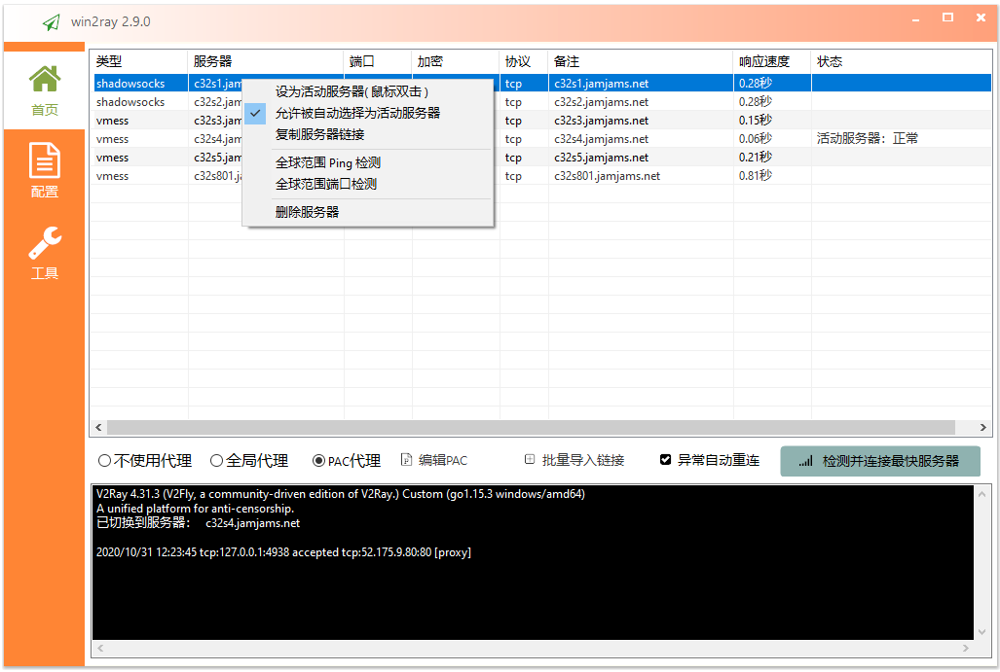
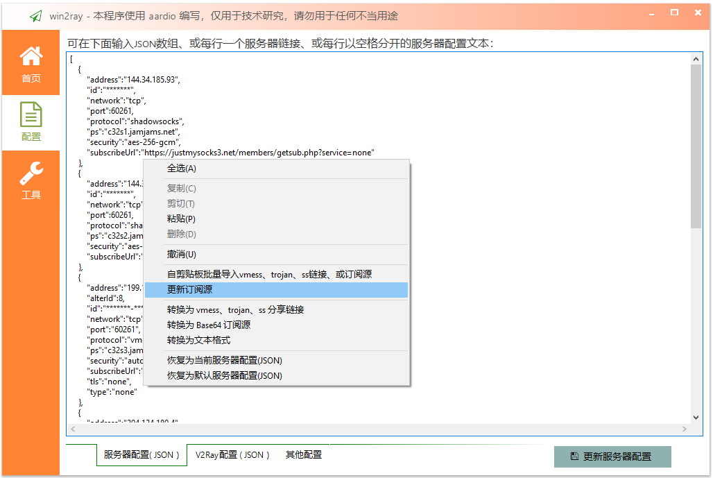

# win2ray 
本软件源码已贡献到公共领域并放弃版权，  
源码可使用 [aardio（开发环境仅6.5MB）](http://www.aardio.com) 编译为exe文件。  

win2ray 是一个简洁稳定的 V2Ray(vmess/vless)、Shadowsocks、Trojan 通用客户端（Windows系统），  
仅生成单文件绿色EXE( 不需要.Net等任何外部运行库 ），**[下载](../../releases/latest)** 解压即可直接使用( 体积非常小 - 仅 **740KB** ）。    

可自动检测并连接访问速度最快的代理服务器。  
服务器连接异常时可以自动更换代理服务器 - 再也不用担心服务器抽风了。

之前我用过很多类似的代理客户端，经常用一会就挂掉了，有些来来回回测试很久才找到下一个可用的服务器，而且有时候怎么切换都不行，一定要把整个软件退出重启才能恢复。而且很多类似软件在WIN10上有一个奇怪的BUG - PAC代理用一段时间就会卡死一定要来回切换代理设置才能正常，其实这些软件里提供的很多功能我并不需要，我只想简单稳定的用下 google 找点技术资料提升下工作效率。但是在网上找了很久都没找到，所以决定自己动手写一个，还好用 aardio 写软件的速度很快 - 大概用了几个小时就完成了 win2ray 的主要代码，改进了几个版本以后就很稳定了，我自己用了 win2ray  几个月再也没有遇到 google 抽风访问不了的问题。  

win2ray支持批量导入 vmess、ss、trojan …… 等格式的分享链接，  
也可以导入订阅链接，以及 base 64、json、文本表格 …… 等不同格式的服务器配置都可以自动识别并导入 win2ray。

可选在 ["/v2ray-core/win2ray-default-servers.json"](./v2ray-core/win2ray-default-servers.json) 文件中添加默认服务器配置（生成EXE后默认配置自动嵌入到EXE文件，可选删除该文件,也可以继续使用该文件覆盖EXE自带的默认服务器列表）。

软件首次运行时会在当前目录查找 "./v2ray-core/v2ray.exe"   
发行文件仅需要 "./win2ray.exe"，可选带上 "./v2ray-core/" 目录（ 如果没有找到会自动到v2ray官网下载，不过没有代理服务器下载有时候非常慢 )。

 
 
 
  

